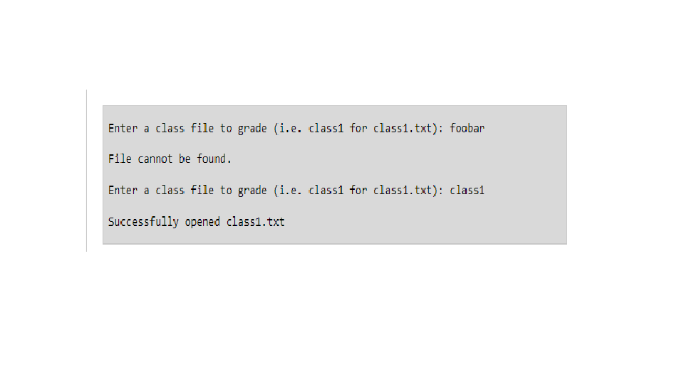
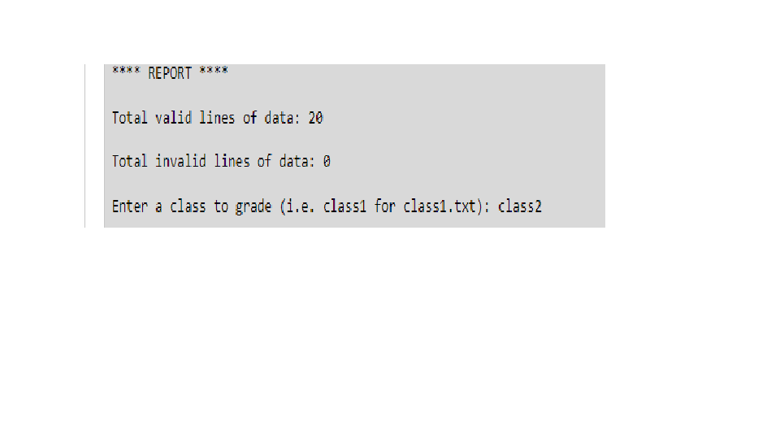
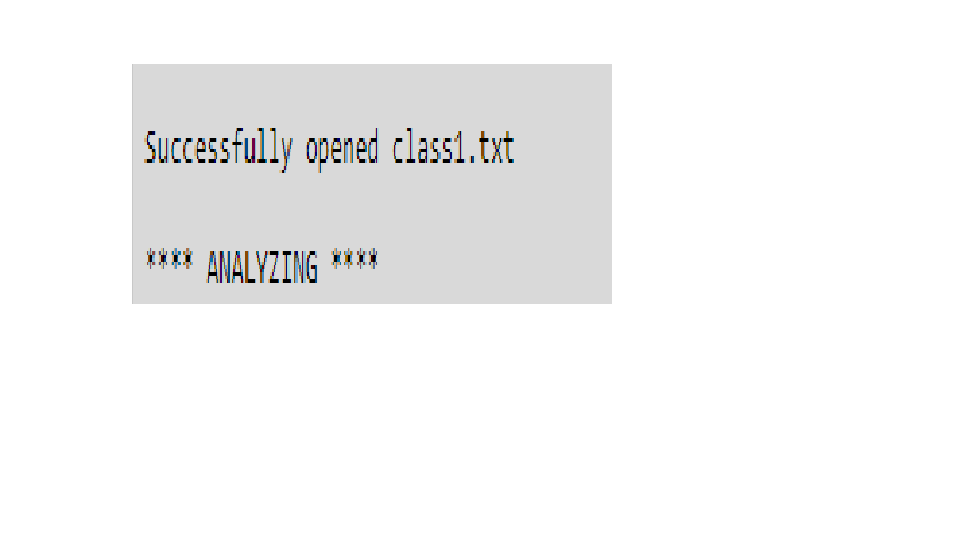
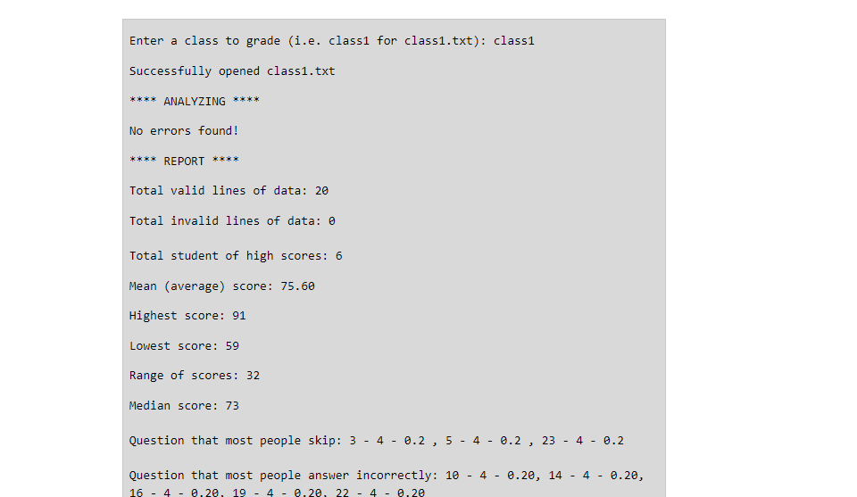
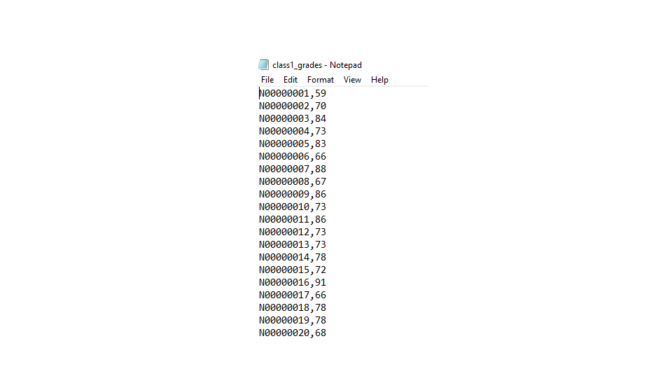

AUTOMATIC GRADING EXAM SYSTEM

1) Run the program
2) Enter the filename you want to input. If the filename incorrect, the program will force you to re-enter the filename again without restarting the program.

4) The program will then report to you what line is valid and what line is not invalid and why (Valid line included student's ID starts with N combining with 8 numbers + 25 answers in total).
   
6) If all student's records in a certain file are valid. The program will report: "No error found!"
   
8) Afterward, the program will report a summary tab about the file including: number of files valid/invalid, min/max scores, numbers of students achieved high score, range of score, average score, median score, questions that most people skipped/ asnwered incorrectly.

10) Finally, the program will extract a csv file including the student's id and his/her overal score.
    